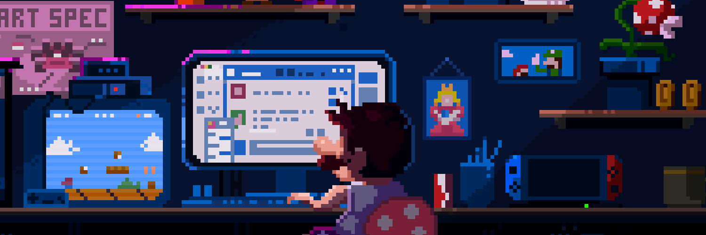

<h2>🖥️ Tecnologias e Ferramentas:</h2> 

 
<code></code>
<code></code>
<code></code>
<code></code>
<code></code>
<code></code>
<code></code>
<code></code>

<h3>🎓Formação</h3>

  
📚 Iniciei meus estudos na área de programação em 2015 com o curso técnico de Informática Para Internet e adquiri conhecimentos em HTML, CSS, PHP E SQL. Atualmente estou finalizando a gradução de Análise e Desenvolvimento de Sistemas. Tenho experiência com Python, Pandas, MongoDB e SQL. Atualmente desenvolvo e otimizo scripts para data visualization, análise de dados e automações de processos.

##

|  |  |  
 | ----------- | ----------- |

<a href="https://www.instagram.com/gabriel.rasquinho/" target="_blank">
<a href="https://www.linkedin.com/in/gabriel-rasquinho-370073157/" target="_blank">
